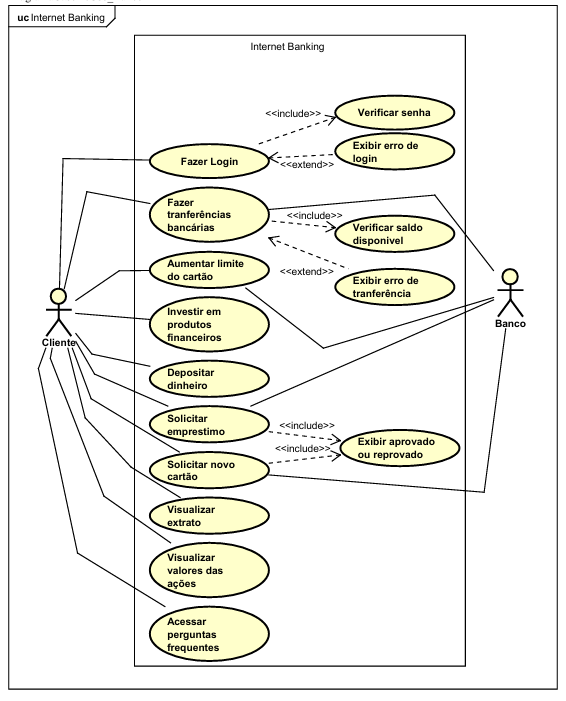

# Plataforma Web para Internet Banking

## Objetivo do Sistema

Este projeto tem como objetivo o desenvolvimento de um sistema de Internet Banking que permita aos usuários realizarem operações bancárias de forma digital e acessível. A plataforma será desenvolvida com foco na experiência do usuário e funcionalidades, oferecendo um ambiente confiável para o gerenciamento de contas pessoais.

O sistema permitirá que os usuários acessem suas contas por meio de login, visualizem informações como saldo, dados pessoais, histórico de transações, empréstimos, além de possibilitar a realização de investimentos em produtos financeiros, além de possibilitar a atualização de seus dados cadastrais.

## Membros da equipe e papel

- Arthur Pinheiro [Back-End]
- Bruno Henrique [Full-Stack]
- Davi Torres [Back-End/Banco de Dados]
- Vanderson Guimarães [Full-Stack]
- Weder [Back-End]
- William Andrade [Full-Stack]

## Tecnologias Utilizadas

- HTML/CSS
- javaScript
- Python
- MySQL

## Backlog do Produto

- [ ] Como usuário, quero poder fazer login para acessar minha conta com segurança.
- [ ] Como usuário, quero fazer transferências bancárias para movimentar meu dinheiro entre contas.
- [ ] Como usuário, quero aumentar o limite do cartão.
- [ ] Como usuário, quero investir meu dinheiro em produtos financeiros (como CDB, LCI) para obter rentabilidade.
- [ ] Como usuário, quero depositar dinheiro na minha conta para aumentar meu saldo e poder usá-lo para futuras transações.
- [ ] Como usuário, quero solicitar um empréstimo para obter crédito e financiar meus projetos pessoais.
- [ ] Como usuário, quero visualizar um extrato detalhado com todas as minhas transações.
- [ ] Como usuário, quero visualizar os valores das ações, acompanhados de indicadores que mostrem se elas tiveram queda ou aumento.
- [ ] Como usuário, quero solicitar um novo cartão caso o atual esteja vencido, perdido ou danificado.
- [ ] Como usuário, quero acessar uma seção de perguntas frequentes para tirar dúvidas comuns sem precisar de atendimento.

## Backlog da Sprint

### História 1: Como usuário, quero poder fazer login para acessar minha conta com segurança.

Tarefas e responsáveis:

- Desenvolver autenticação de usuário (e-mail/senha) [Davi Torres]

- Implementar validações de campos obrigatórios [Vanderson Guimarães]

- Criar tela de login de usuários com HTML/CSS [Vanderson Guimarães]
  
- Criar tela deskboard para navegação com HTML/CSS {Bruno Azevedo]

- Criar tela de cadastro de usuários com HTML/CSS [Vanderson Guimarães]

- Criar tela de atualização de usuários com HTML/CS [William Andrade]

- Criar tela de exclusãoo de usuários com HTML/CSS [Vanderson Guimarães]

### História 2: Como usuário, quero fazer transferências bancárias para movimentar meu dinheiro entre contas.

Tarefas e responsáveis:

- Criar lógica para transferência entre contas [Arthur Pinheiro]

- Validar saldo disponível antes da operação [Arthur Pinheiro]

- Registrar histórico de transações [Weder]

### História 3: Como usuário, quero aumentar o limite do cartão.

Tarefas e responsáveis:

- Criar regras para aprovação de aumento de limite [Davi Torres]

- Implementar comunicação com banco de dados [Vanderson Guimarães]

- Exibir notificações ao usuário sobre aprovação ou recusa [William Andrade]

### História 4: Como usuário, quero investir meu dinheiro em produtos financeiros (como CDB, LCI) para obter rentabilidade

Tarefas e responsáveis:

- Criar interface para escolha de investimento [Bruno Azevedo]

- Implementar lógica de rendimento e resgate [William Andrade]

- Integrar com banco de dados para registro [Davi Torres]

### História 5: Como usuário, quero depositar dinheiro na minha conta para aumentar meu saldo e poder usá-lo para futuras transações.

Tarefas e responsáveis:

- Implementar funcionalidade de depósito [Arthur Pinheiro]

- Validar transação e atualizar saldo do usuário [Vanderson Guimarães]

- Criar interface de confirmação de depósito [Bruno Azevedo]

### História 6: Como usuário, quero solicitar um empréstimo para obter crédito e financiar meus projetos pessoais.

Tarefas e responsáveis:

- Criar regras de aprovação para solicitação de crédito [Arthur Pinheiro]

- Desenvolver tela para cadastro de empréstimos [Vanderson Guimarães]

- Integrar sistema com cálculo de taxas e parcelas [Weder]

### História 7: Como usuário, quero visualizar um extrato detalhado com todas as minhas transações.

Tarefas e responsáveis:

- Criar a Interface de Exibição do Extrato. [William Andrade]

- Integrar com o Sistema de Transações. [Arthur Pinheiro]

- Definir Critérios de Exibição. [Davi Torres]

### História 8: Como usuário, quero visualizar os valores das ações, acompanhados de indicadores que mostrem se elas tiveram queda ou aumento.

Tarefas e responsáveis:

- Criar a interface de exibição das ações. [Bruno Azevedo]

- Configurar API externa para mostrar a cotação das ações [Vanderson Guimarães]

### História 9 : Como usuário, quero solicitar um novo cartão caso o atual esteja vencido, perdido ou danificado.

Tarefas e responsáveis:

- Criar formulário de solicitação de novo cartão com motivo [William Andrade]

- Implementar regras de elegibilidade e limites de solicitação [Weder]

- Notificar o usuário sobre o status da solicitação [Arthur Pinheiro]

### História 10: Como usuário, quero acessar uma seção de perguntas frequentes para tirar dúvidas comuns sem precisar de atendimento.

- Criar interface clara e acessível com categorias de perguntas frequentes [Bruno Azevedo]

- Implementar função de busca por palavras-chave no FAQ [Vanderson Guimarães]

- Implementar sistema de feedback do tipo “Essa resposta foi útil?” [Weder]

## Diagrama de Caso de Uso

## Diagramas de Atividades
- História 1: Como usuário, quero poder fazer login para acessar minha conta com segurança.

- História 2: Como usuário, quero fazer transferências bancárias para movimentar meu dinheiro entre contas.

- História 3: Como usuário, quero aumentar o limite do cartão.

- História 4: Como usuário, quero investir meu dinheiro em produtos financeiros (como CDB, LCI) para obter rentabilidade.

- História 5: Como usuário, quero depositar dinheiro na minha conta para aumentar meu saldo e poder usá-lo para futuras transações.

- História 6: Como usuário, quero solicitar um empréstimo para obter crédito e financiar meus projetos pessoais.

- História 7: Como usuário, quero visualizar um extrato detalhado com todas as minhas transações.

- História 8: Como usuário, quero visualizar os valores das ações, acompanhados de indicadores que mostrem se elas tiveram queda ou aumento.

- História 9 : Como usuário, quero solicitar um novo cartão caso o atual esteja vencido, perdido ou danificado.

- História 10: Como usuário, quero acessar uma seção de perguntas frequentes para tirar dúvidas comuns sem precisar de atendimento.

